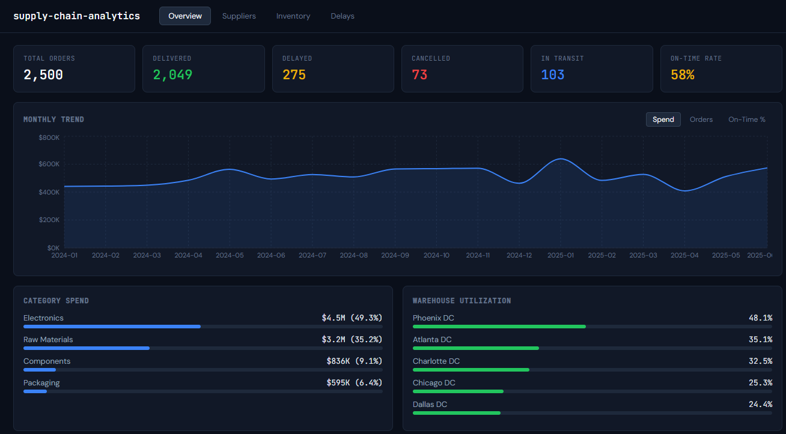

# Supply Chain Analytics

End-to-end analytics workflow using synthetic supply chain data, Python ETL, SQLite analytics, and a React dashboard.



The dataset is generated for the project, so the findings below reflect the generated scenario rather than a real company. The goal was to move data through the full pipeline from raw operational tables to dashboard-ready metrics.

## What It Does

- Generates synthetic suppliers, warehouses, products, purchase orders, and inventory records
- Loads the CSV data into a normalized SQLite database
- Runs SQL queries for delivery performance, supplier scorecards, inventory health, and delay analysis
- Exports pre-computed metrics to JSON for the frontend
- Displays the results in a Vite/React dashboard using Recharts

## Sample Output

- 58% on-time delivery rate across 2,500 generated purchase orders
- Port congestion and weather disruption are the largest delay categories in the generated data
- Electronics represents the largest share of generated spend
- 8 inventory items are below reorder point in the generated inventory snapshot

## Architecture

```text
Raw CSVs -> Python ETL -> SQLite DB -> SQL Analytics -> JSON -> React Dashboard
```

## Tech Stack

| Layer | Technology |
| --- | --- |
| Data generation | Python, csv, random |
| Database | SQLite |
| ETL | Python, sqlite3, JSON export |
| SQL | Joins, CTEs, CASE expressions, aggregate queries |
| Frontend | Vite, React, Recharts |
| Deployment | GitHub Pages |

## Data Model

The project uses 5 normalized tables with foreign key relationships:

- `suppliers`: vendor profiles with reliability scores
- `warehouses`: distribution centers with capacity
- `products`: SKUs across product categories
- `orders`: purchase orders with delivery tracking
- `inventory`: stock levels by warehouse and product

Example supplier scorecard query:

```sql
SELECT s.name, s.region,
    ROUND(100.0 * SUM(CASE WHEN o.status='Delivered'
        AND o.actual_delivery <= o.expected_delivery THEN 1 ELSE 0 END)
        / NULLIF(SUM(CASE WHEN o.status IN ('Delivered','Delayed')
        THEN 1 ELSE 0 END), 0), 1) AS on_time_pct
FROM orders o
JOIN suppliers s ON o.supplier_id = s.supplier_id
GROUP BY s.supplier_id
ORDER BY on_time_pct DESC;
```

## Project Structure

```text
supply-chain-analytics/
├── data/raw/              # Generated CSV files
├── etl/
│   ├── generate_data.py   # Synthetic data generation
│   └── etl_pipeline.py    # Load, transform, query, and export
├── sql/
│   ├── schema.sql         # Tables, indexes, and constraints
│   └── queries.sql        # Analytical queries
├── src/
│   ├── App.jsx
│   ├── data/metrics.json
│   └── components/
├── index.html
├── package.json
└── vite.config.js
```

## How to Run

Prerequisites: Python 3.10+ and Node.js 18+

```bash
python etl/generate_data.py
python etl/etl_pipeline.py
npm install
npm run dev
```

The dashboard loads at `http://localhost:5173/supply-chain-analytics/`.

## Dashboard

The dashboard includes four views:

- Overview
- Suppliers
- Inventory
- Delays
